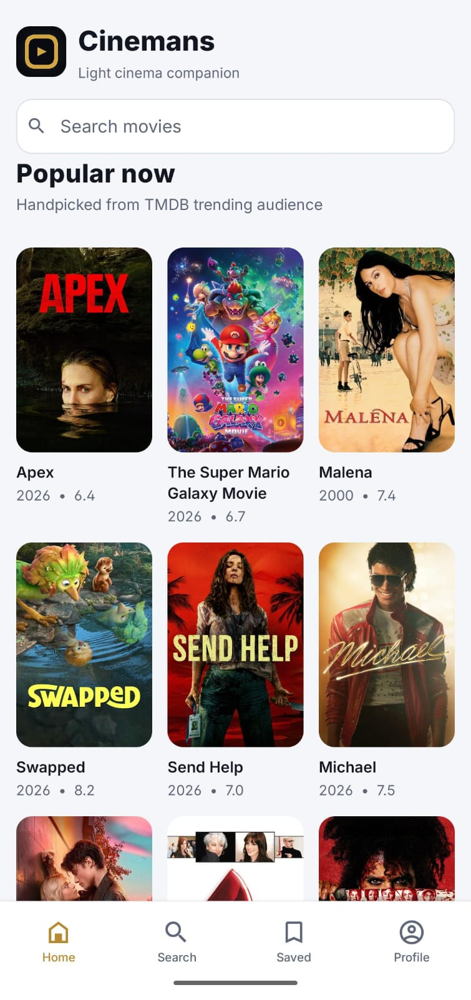
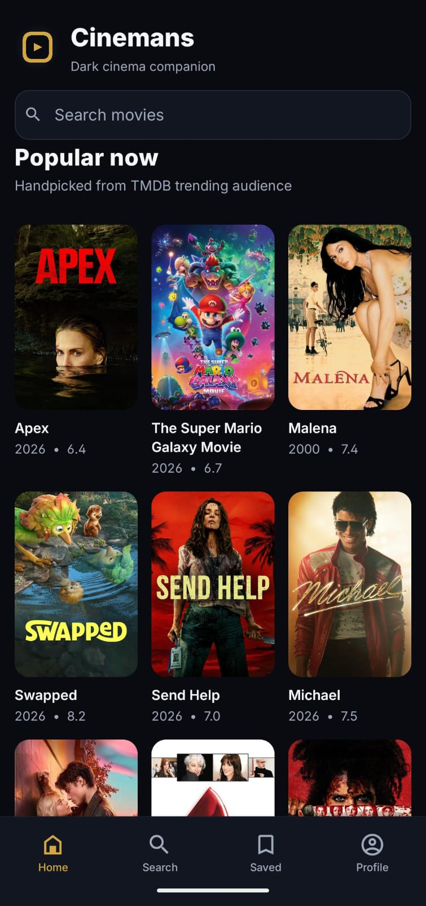

# Movies Mobile

A React Native + Expo movie app I built while learning React Native end-to-end.

## Why I built this

I built this project to practice:
- Expo Router navigation
- How basic react-native works 
- Can be useful for buiding apps fast during hackathons

## Download APK

If you just want to try the app, download the latest APK from GitHub Releases:

- https://github.com/wrestle-R/Movies-mobile/releases

Tip: open the latest release and download the `.apk` asset.

## Screenshots

### Light Mode

### Dark Mode

